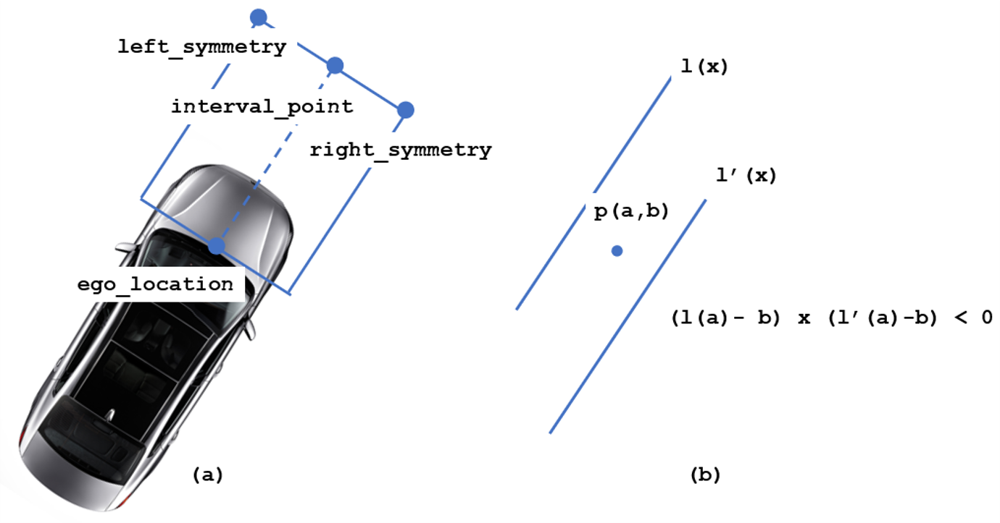

# Carla Simulator 

- [데모 영상](https://github.com/happyOBO//leaderboard#1-데모-영상)
- [설치 및 실행방법](https://github.com/happyOBO/leaderboard#2-설치-및-실행-방법)
- [코드 설명](https://github.com/happyOBO/leaderboard#3-코드-설명)

## 1. 데모 영상

[](https://youtu.be/K5ujXesSI_4)

## 2. 설치 및 실행 방법

1. 기본 환경 설정
    1. Nvidia 설정
        - ``System Settings > Software & Updates > Additional Drivers`` 탭에 들어가서 ``Using Nvidia binary driver`` 를 클릭합니다
    2. anaconda 설치
        - [anaconda 사이트](https://www.anaconda.com/products/individual#linux)에서 자신에게 맞게 설치합니다.
2. 설치
    1. 이미 ``carla (CARLA 0.9.10.1)``와 ``Scenario_Runner``가 있다면 5번 부터 진행해주시길 바랍니다.
    2.  [CARLA 0.9.10.1](https://carla-releases.s3.eu-west-3.amazonaws.com/Linux/CARLA_0.9.10.1.tar.gz)을 다운로드 받습니다. 

    3. 압축 파일을 풀고, CARLA PYTHON API를 사용하기 위해 몇가지 종속성을 설치합니다.
        ```bash
        conda create -n py37 python=3.7
        conda activate py37 # 아나콘다 예전 버전은 source activate py37 
        cd ${CARLA_ROOT}  # Change ${CARLA_ROOT} for your CARLA root folder
        pip3 install -r PythonAPI/carla/requirements.txt
        easy_install PythonAPI/carla/dist/carla-0.9.10-py3.7-linux-x86_64.egg
        ```
    4. Scenario_Runner 레포지토리도 다운받고, 종속성을 설치합니다.
        ```bash
        git clone -b leaderboard --single-branch https://github.com/carla-simulator/scenario_runner.git
        cd ${SCENARIO_RUNNER_ROOT} # Change ${SCENARIO_RUNNER_ROOT} for your Scenario_Runner root folder
        pip3 install -r requirements.txt
        ```
    5. 제가 변경한 ``leader_board`` 코드들을 다운 받고 ``python`` 종속성을 설치합니다.
        ```bash
        git clone https://github.com/happyOBO/leaderboard.git
        cd ${LEADERBOARD_ROOT} # Change ${LEADERBOARD_ROOT} for your Leaderboard root folder
        pip3 install -r requirements.txt
        ```
    6. ``~/.bashrc`` 파일에 아래와 같이 환경변수를 추가합니다.
        ```bash
        # .bashrc
        export CARLA_ROOT=PATH_TO_CARLA_ROOT
        export SCENARIO_RUNNER_ROOT=PATH_TO_SCENARIO_RUNNER
        export LEADERBOARD_ROOT=PATH_TO_LEADERBOARD
        export PYTHONPATH="${CARLA_ROOT}/PythonAPI/carla/":"${SCENARIO_RUNNER_ROOT}":"${LEADERBOARD_ROOT}":${PYTHONPATH}
        ```
3.  실행
    1. 사용할 모든 터미널에 이전에 만들었던 가상환경을 활성화 시킵니다.
        ```bash
        conda activate py37 # 또는 source activate py37
        ```
    2. 한 터미널에 CARLA 서버를 실행시킵니다. 저는 ``-opengl``을 추가한 상태에서 과제를 진행했습니다.
        ```bash
        cd ${CARLA_ROOT}
        ./CarlaUE4.sh -quality-level=Epic -opengl -world-port=2000 -resx=800 -resy=600
        ```
    3. 다른 한 터미널에는 환경변수를 추가해주고, ``run_evalution.sh``를 실행시킵니다.
        ```bash
        export SCENARIOS=${LEADERBOARD_ROOT}/data/all_towns_traffic_scenarios_public.json
        export ROUTES=${LEADERBOARD_ROOT}/data/routes_devtest.xml
        export REPETITIONS=1
        export DEBUG_CHALLENGE=1
        export TEAM_AGENT=${LEADERBOARD_ROOT}/leaderboard/autoagents/human_agent.py
        export PYTHONPATH="${CARLA_ROOT}/PythonAPI/carla/":"${SCENARIO_RUNNER_ROOT}":"${LEADERBOARD_ROOT}":${PYTHONPATH}
        export CHECKPOINT_ENDPOINT=${LEADERBOARD_ROOT}/results.json
        export CHALLENGE_TRACK_CODENAME=SENSORS

        $LEADERBOARD_ROOT/scripts/run_evaluation.sh
        ```
    4. ``Ctrl`` + ``C`` 키를 통해 현재 시나리오를 중단 시키고 다음 맵으로 이동할 수 있습니다. 

## 3. 코드 설명
- ``leader_board``에서 제공하는 코드를 변경해서 구현하였습니다. 제가 구현한 코드가 비중 높게 있는 파일들은 ``${LEADERBOARD_ROOT}/leaderboard/scenarios/scenario_manager.py`` 와 ``${LEADERBOARD_ROOT}/leaderboard/autoagents/human_agent.py`` 입니다.
1. agent는 1개의 camera sensor로부터 들어오는 영상을 매 프레임 디스플레이에 보여줍니다.
    - ``human_agent.py``에서 ``sensor``를 정의합니다.
        ```py
        sensors = [
        {'type': 'sensor.camera.rgb', 'x': 0.7, 'y': 0.0, 'z': 1.60, 'roll': 0.0, 'pitch': 0.0, 'yaw': 0.0,
            'width': 800, 'height': 600, 'fov': 100, 'id': 'Center'},
        {'type': 'sensor.speedometer', 'reading_frequency': 20, 'id': 'speed'},
        ]
        ```
    - ``scenario_manager.py``에서 ``setup_sensors()``릍 통해 ``ego_vehicle``에 센서를 설정합니다.
        ```py
        self._agent.setup_sensors(self.ego_vehicles[0], self._debug_mode)
        ```
    - ``sensor_interface.py`` 에서 ``update_sensor()``를 통해 센서 값을 누적시킵니다.
        ```py
        self._data_provider.update_sensor(tag, array, image.frame)
        ```
    - ``autonomous_agent.py``에서 ``self.sensor_interface.get_data()``를 통해 데이터를 불러옵니다.
        ```py
        input_data = self.sensor_interface.get_data()
        ```
    - ``human_agent.py``에서 ``pygame``을 통해 ``id``가 ``Center``인 데이터 값을 디스플레이에 보여줍니다.
        ```py
        image_center = input_data['Center'][1][:, :, -2::-1]
        self._surface = pygame.surfarray.make_surface(image_center.swapaxes(0, 1))
        self._display.blit(self._surface, (0, 0))
        ```
2. agent는 ego vehicle로부터 50m 반경내에 위치하는 모든 Vehicle과 Walker의 bounding box를 camera sensor로부터 들어오는 영상 위에 overlay하여 그려줍니다.
    - ``scenario_manager.py``에서 ``world.get_actors().filter('vehicle.*')`` 를 통해 모든 ``vehicle actor``정보를 불러옵니다.
    - 해당 ``vehicle``의 ``location``에서  ``ego_vehicle``의 ``location``까지의 거리가 50m 이내라면 ``draw_box``를 통해 박스를 그려냅니다.
        ```py
        for vehicle in world.get_actors().filter('vehicle.*'):
            vehicle_location = vehicle.get_location()
            if(ego_vehicle.id != vehicle.id and vehicle.is_alive): # ego_vehicle 이 아니고, 살아있는 vehicle 에 대해서만 박스를 그린다.
                if((ego_location.x -vehicle_location.x)**2 + (ego_location.y - vehicle_location.y)**2  < 2500): # 거리의 제곱이 50^2 이내일때
                    
                    # draw Box
                    transform = vehicle.get_transform()
                    bounding_box = vehicle.bounding_box
                    bounding_box.location += transform.location
                    world.debug.draw_box(bounding_box, transform.rotation, thickness = 0.1, color = carla.Color(10,15,219,0), life_time=0.006) # vehicle은 파란 박스!
                            
        ```
    - ``walker`` 또한 같은 과정을 거칩니다.
4. agent는 keyboard 입력을 받아, ego vehicle의 steer, throttle, brake를 제어합니다.
    - 기본적으로 ``vehicle``의 컨트롤은 ``get_control()``을 통해 받아오고, ``apply_control()``을 통해 적용시킵니다.
    - ``pygame.key.get_pressed()``를 통해 키보드 값을 받아오고, 키보드 값에 알맞게 해당 값을 변경시킵니다.
        ```py
            if keys[K_UP] or keys[K_w]:
                self._control.throttle = 0.6
            else:
                self._control.throttle = 0.0

            steer_increment = 3e-4 * milliseconds
            if keys[K_LEFT] or keys[K_a]:
                self._steer_cache -= steer_increment
            elif keys[K_RIGHT] or keys[K_d]:
                self._steer_cache += steer_increment
            else:
                self._steer_cache = 0.0
        ```

5. agent는 ego vehicle로부터 전방 0m ~ 10m, 좌우 -3m ~ 3m 내에 다른 actor (Vehicle, Walker)가 존재할 경우, brake 값을 1.0으로 유지합니다.
    - 전방, 좌우 영역을 지정하기 위해 ``ego_vehicle``의 ``location`` 과 ``rotation``을 사용합니다. ``rotation.yaw``를 통해 해당 방향에서 원하는 ``distance``만큼 떨어져 있는 지점을 찾을 수 있습니다. 
        ```py
        # 전 좌 우 방향에서 각각 angle 은 0, -90, 90 
        interval_point.x = ego_location.x + distance * cos(radians(yaw + angle))
        interval_point.y = ego_location.y + distance * sin(radians(yaw + angle))
        ```
    - 차량의 방향을 기준으로 ``interval_point`` 에서부터 width 만큼 떨어진 점 ``left_symmetry``, ``right_symmetry``를 구할 수 있습니다.
        ```py
        # slope 는 tan(radians(yaw + angle))
        left_symmetry.x = - width * slope * math.sqrt(1/ (slope **2 + 1)) + interval_point.x 
        left_symmetry.y = width * math.sqrt( 1 / (slope **2 + 1)) + interval_point.y
        right_symmetry.x = width * slope * math.sqrt( 1 / (slope **2 + 1)) + interval_point.x 
        right_symmetry.y = - width * math.sqrt(1  / (slope**2 + 1)) + interval_point.y
        ```
    - 아래의 사진(a) 처럼 ``ego_vehicle``의 방향을 기준으로 ``interval_point`` , ``ego_location``을 각각 지나는 법선 두개와 ``left_symmetry`` , ``right_symmetry``을 각각 지나는 평행선 두개를 알 수 있습니다.
    - 아래의 사진(b) 와 같이 현재 탐색하는 ``vehicle / walker``의 ``location.x`` 값을 서로 마주보는 직선들에 대입한 값에서 ``vehicle / walker``의 ``location.y``을 뺀 값의 곱이 음수라면, 두 직선 사이에 ``vehicle / walker`` 이 존재한다고 할 수 있습니다.

        
    - 곱이 음수 일 때, ``brake`` 값을 ``1.0``으로 바꿔줍니다.
        ```py
        front_diff = (vehicle_location.x - interval_point.x) / slope + interval_point[i].y - vehicle_location.y
        back_diff = (vehicle_location.x - ego_location.x) / slope + ego_location.y - vehicle_location.y
        left_diff = (vehicle_location.x - left_symmetry.x ) * slope[i] + left_symmetry.y - vehicle_location.y
        right_diff = (vehicle_location.x - right_symmetry.x) * slope[i] + right_symmetry.y - vehicle_location.y
        if(front_diff * back_diff < 0 and left_diff * right_diff < 0):
            control.brake = 1.0
        ```
6. agent는 ego vehicle과 다른 actor (Vehicle, Walker)와의 CollisionEvent를 count하여 디스플레이상에 충돌 횟수를 점수로 보여줍니다.
    - ``Criterion``의 결과를 저장하는 ``criteria_tree``에서 ``get_criteria()``와 ``filter``를 이용해서 충돌 횟수를 받아옵니다.
    - display에 나타내면 좋은 항목들을 ``display_additional_info``에 저장합니다.
    - ``display_additional_info`` : ``ego_vehicle``의 ``steer``, ``throttle``, ``brake`` , 충돌 횟수, 전,좌우 영역에 위치한 ``actor``의 ``type_id``
    - ``human_agent.py``에서 ``pygame``을 통해 해당 값들을 디스플레이에 보여줍니다.